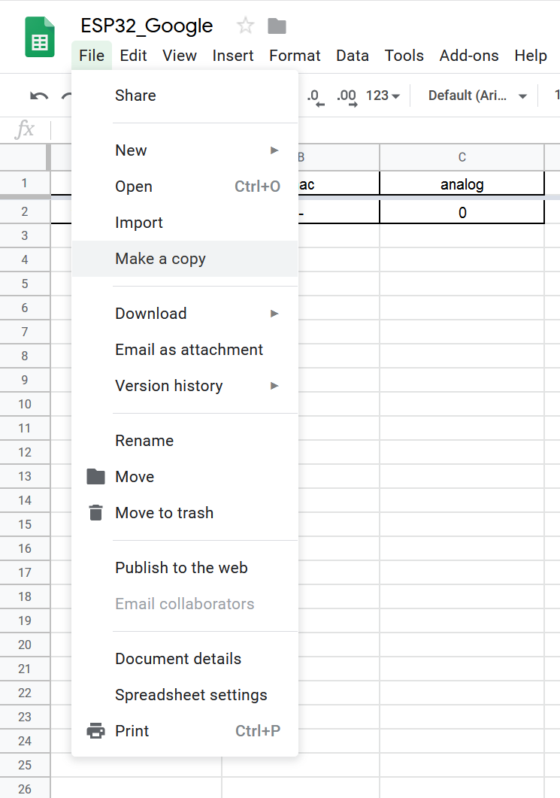
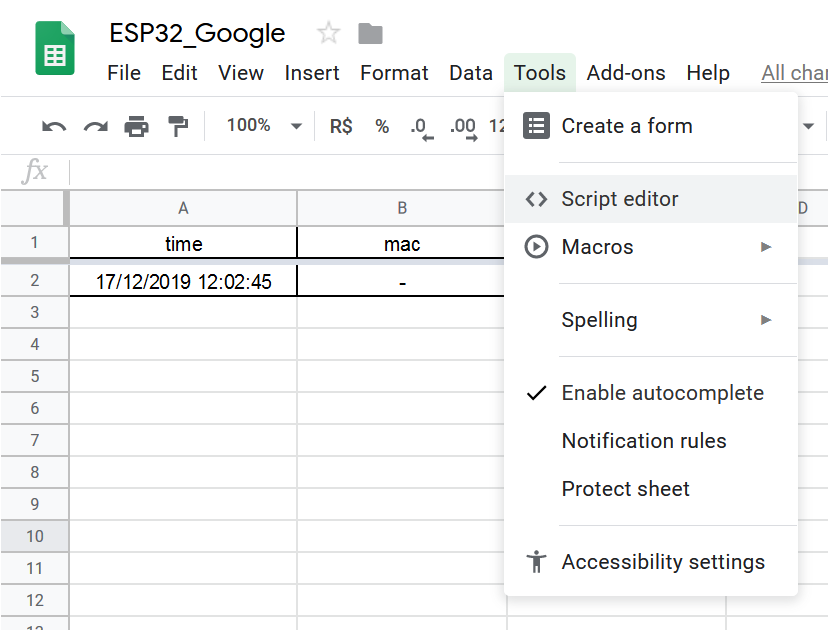
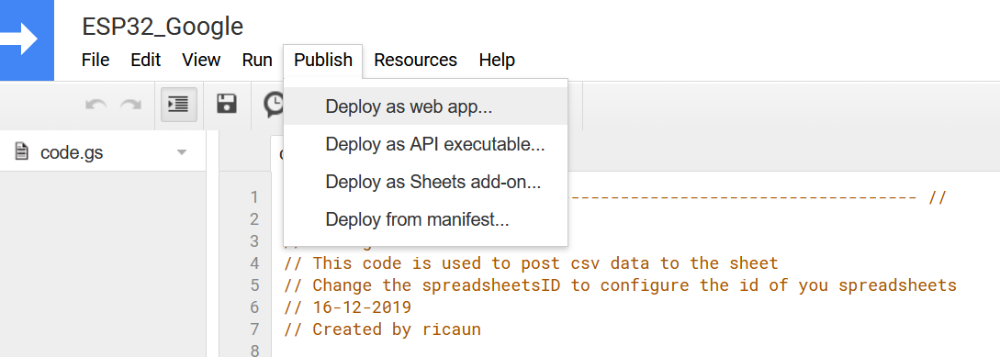
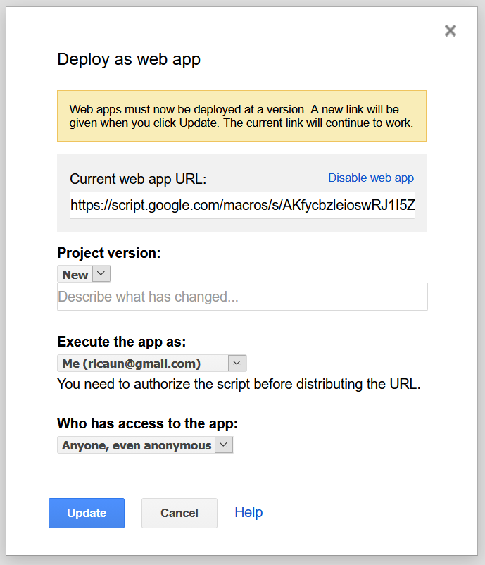
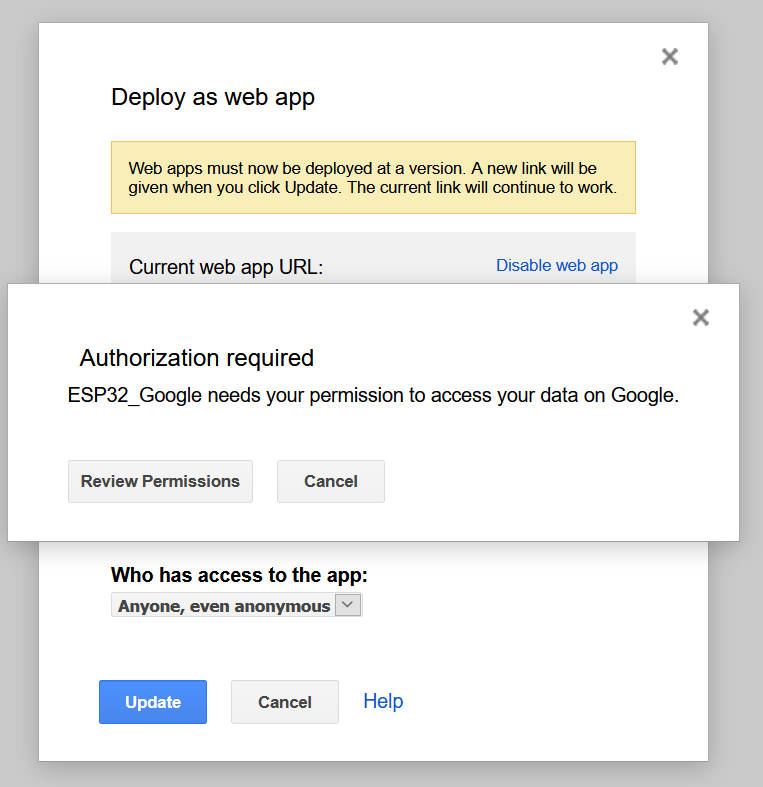
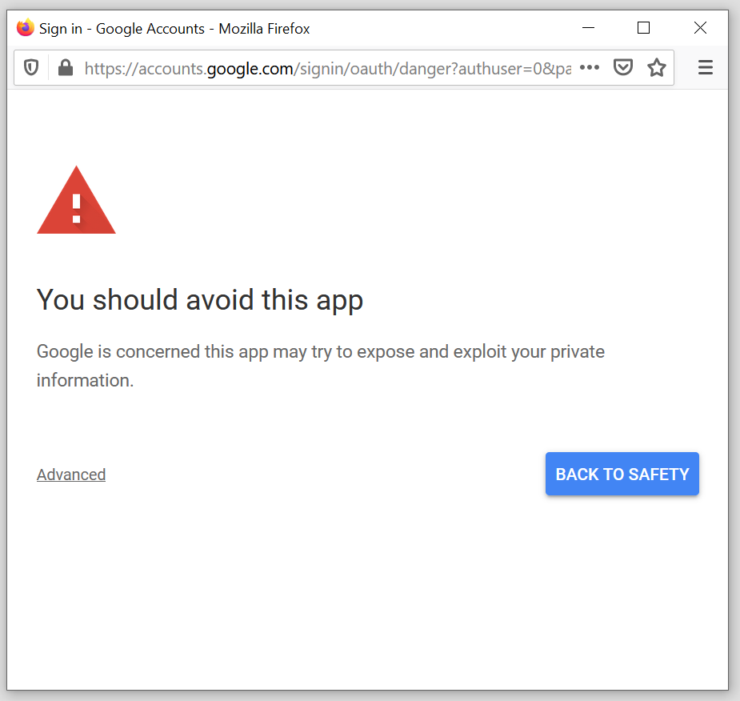
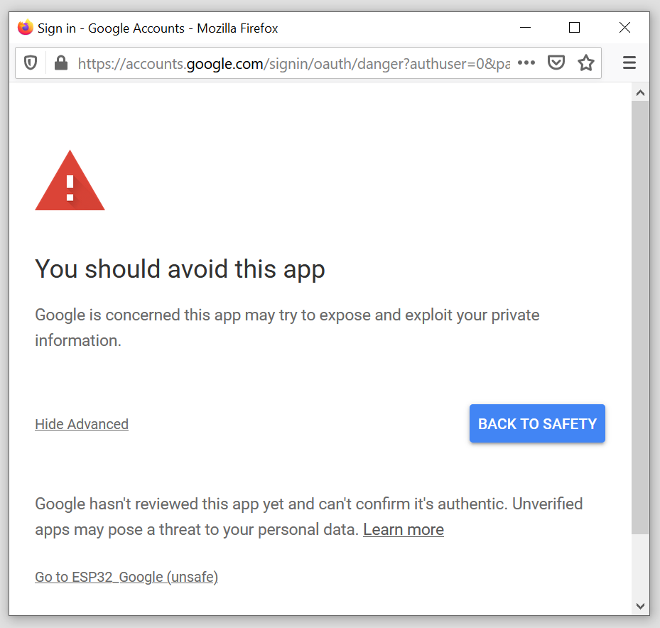
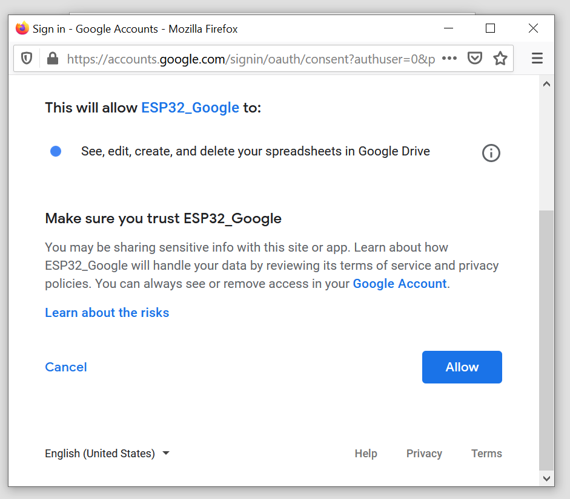
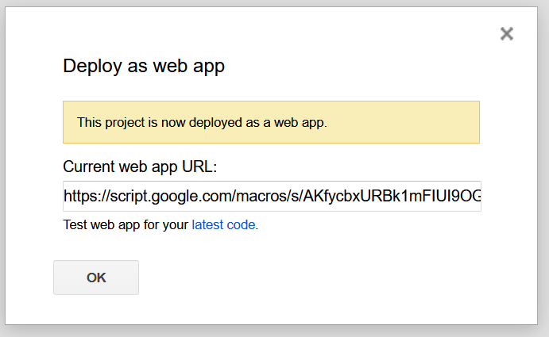

# esp32-google-sheet

This project is an example of how to create and add data on a [Google Spreadsheet][1] using esp32.

The program read the analog 0 add value on a buffer and sends every 30 seconds to the [Google Spreadsheet][1].

## Wifi

* ssid - wifi ssid
* password - wifi password

## PINOS

* ANALOG_PIN - analog input
* ANALOG_TIME - read analog sample

## Google

* GOOGLE_URL - google url script
* GOOGLE_TIME - send to google sample

# Google Spreadsheet

First at all you need to make a copy of the [ESP32_Google][2] and save on your drive.

After make a copy open the script editor.

## Google Stript

You need to publish the script and deploy as web app.

Select `Execute the app as:` Me. 

Select `Who has access to the app:` Anyone, even annonymous.

Now you need to give authorization to the app, review permissions.

Open advanced and `Go to ESP32_Google`.

`Allow.`

You deploy is ready.

Select the `Current web app URL` copy open a new page with the url. If everything has gone right you can see the Spreadsheet name.

Paste the `Current web app URL` on the `GOOGLE_URL` define on the esp32-google-sheet.

----
 

 This work is licensed under a <a rel="license" href="https://creativecommons.org/licenses/by-sa/4.0/">Creative Commons Attribution-ShareAlike 4.0 International License</a>.

[1]: https://docs.google.com/spreadsheets/
[2]: https://docs.google.com/spreadsheets/d/11VS5QQhGR095CX6Sf-s5ar5jaTDVsAoa5uFUXeVMZts/edit?usp=sharing